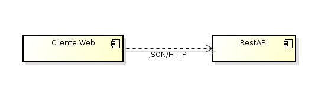
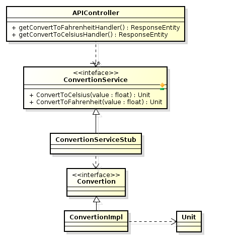

# Convertion app

#### parcial final ARSW

##### Sergio Andrés Rodríguez Torres

La aplicacion consta de in restAPI que provee ds servicios para la convericion de unidades, estos son celcius a fahrenheit y fahrenheit a celcius.

La comunicacion con el RestAPI es mediante onjetos JSON.

Se provee un cliente de ejemplo del uso del RestAPI, el cuela hace peticiones asincronas.

El proyecto esta contruido sobre SpringBoot.

El restAPI provee mediante el verbo GET dos rutas una en /convertion/fahrenheit/{value} para convertir de celcius a fahrenheit, y en /convertion/celsius/{value} para convertir de fahrenheit a celcius
                         Este retorna un objeto JSON en el siguente formato {"value":valor convertdo, "type":tipo de la conversion realizada}

Se realizan pruebas concurrentes sobre el RestAPI para verifiar su funcionamiento ante llamados concurentes.

### Diagrama de componentes

### Diagrama de clases

## Atributos de calidad

### Disponibilidad

Debe estar disponible como minimo 20 horas de las 24 por día

### Flexibilidad

Al aplicacion debe contar con interfaces inyectables que garanticen la facil modificaion y extencion de nuevas conversiones

### Integridad

No debe haber informacion que pueda ser comprometida o almacenda

### Interoperabilidad

Todos los mensajes a aplicaciones externas deben realizarse por onjetos JSON que faciliten la comunicacion

### Confiabilidad

El error de presicion en las converciones debe ser menor a 10^-5

## Limitaciones

No tiene control sobre la seguridad ni el numero de peticiones que se pueden hacer al RestAPI, no lleva ningun registro de la peticiones ni de quien las hace, esto la convierte en una aplicacion vulnerable a
ataques

### [link Heroku](https://parcial-final-arsw.herokuapp.com)
